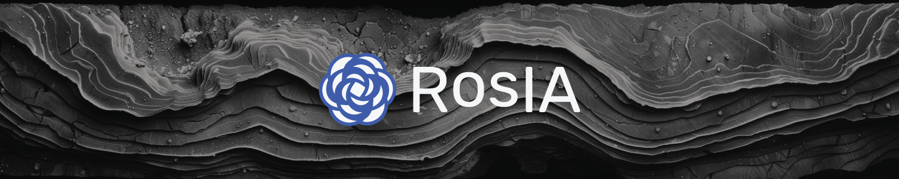

# 🪨 Reflection Connection: Bringing New Algorithms to Old Data



This project uses Siamese Neural Networks (SNN) to analyze seismic data, aiding geoscientists in identifying subsurface geological structures. SNNs are trained on a limited dataset of seismic features to recognize and match similar patterns within a larger corpus. This approach reduces manual effort and error, empowering researchers to focus on integrating geological insights into comprehensive models of the Earth's subsurface.

This project was made possible by our compute partners [2CRSI](https://2crsi.com/)
and [NVIDIA](https://www.nvidia.com/).

## 🏆 Challenge ranking

## 🖼️ Result example

## 🏛️ Proposed solution

## #️⃣ Command lines

## 🔬 References

## 📝 Citing

```
@misc{UrgellReberga:2024,
  Author = {Baptiste Urgell and Louis Reberga},
  Title = {Reflection Connection},
  Year = {2024},
  Publisher = {GitHub},
  Journal = {GitHub repository},
  Howpublished = {\url{https://github.com/association-rosia/reflection-connection}}
}
```

## 🛡️ License

Project is distributed under [MIT License](https://github.com/association-rosia/reflection-connection/blob/main/LICENSE)

## 👨🏻‍💻 Contributors

Louis
REBERGA <a href="https://twitter.com/rbrgAlou"></a> <a href="https://www.linkedin.com/in/louisreberga/"></a> <a href="louis.reberga@gmail.com"></a>

Baptiste
URGELL <a href="https://twitter.com/Baptiste2108"></a> <a href="https://www.linkedin.com/in/baptiste-urgell/"></a> <a href="baptiste.u@gmail.com"></a> 
