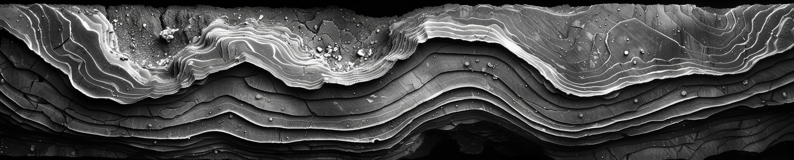

# 🔗 Reflection Connection: Bringing New Algorithms to Old Data



In this innovative challenge, part of the Encoded Reality Series, data scientists are tasked with harnessing their unique ability to transfer solutions across disciplines. The objective is to adapt an algorithm originally designed for generic computer vision tasks to the specialized field of geophysics. Participants will employ Siamese Neural Networks (SNN), known for their proficiency in one-shot learning, to identify and match similar seismic images from a limited dataset across eight categories. The goal is to train the algorithm to recognize complex features within seismic data, much like a geoscientist discerns geological structures such as river channels, salt pans, or faults in black-and-white seismic imagery. This challenge offers an experimental platform for participants to showcase innovative applications of SNNs, ultimately aiding geoscientists in developing more comprehensive Earth models by quickly identifying key seismic features, thereby enhancing their ability to integrate various data into their analyses.

This project was made possible by our compute partners [2CRSI](https://2crsi.com/)
and [NVIDIA](https://www.nvidia.com/).

## 🏆 Challenge ranking

## 🖼️ Result example

## 🏛️ Proposed solution

## #️⃣ Command lines

## 🔬 References

## 📝 Citing

```
@misc{UrgellReberga:2024,
  Author = {Baptiste Urgell and Louis Reberga},
  Title = {Reflection Connection},
  Year = {2024},
  Publisher = {GitHub},
  Journal = {GitHub repository},
  Howpublished = {\url{https://github.com/association-rosia/reflection-connection}}
}
```

## 🛡️ License

Project is distributed under [MIT License](https://github.com/association-rosia/reflection-connection/blob/main/LICENSE)

## 👨🏻‍💻 Contributors

Louis
REBERGA <a href="https://twitter.com/rbrgAlou"></a> <a href="https://www.linkedin.com/in/louisreberga/"></a> <a href="louis.reberga@gmail.com"></a>

Baptiste
URGELL <a href="https://twitter.com/Baptiste2108"></a> <a href="https://www.linkedin.com/in/baptiste-urgell/"></a> <a href="baptiste.u@gmail.com"></a> 
