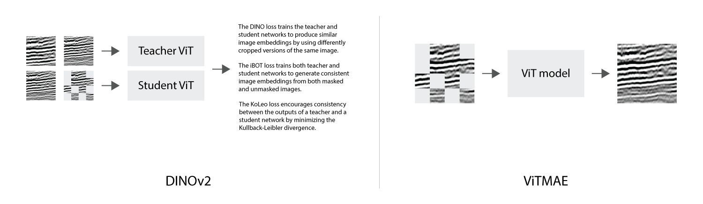
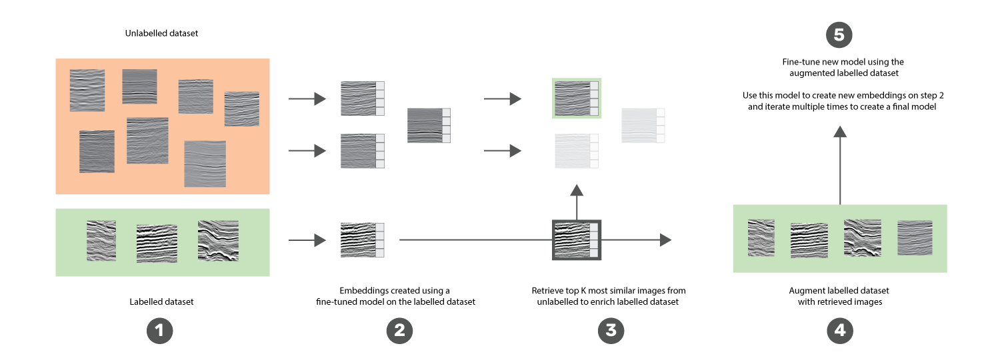

# 🪨 Reflection Connection


This project uses Siamese Neural Networks (SNN) to analyze seismic data, aiding geoscientists in identifying subsurface
geological structures. SNNs are trained on a limited dataset of seismic features to recognize and match similar patterns
within a larger corpus. This approach reduces manual effort and error, empowering researchers to focus on integrating
geological insights into comprehensive models of the Earth's subsurface.

This project was made possible by our compute partners [2CRSI](https://2crsi.com/)
and [NVIDIA](https://www.nvidia.com/).

## 🏆 Challenge ranking
The score of the challenge was a custom score. The evaluation metric used for scoring will be weighted accuracy:


The final score for all N query images is then calculated as follows:


Our solution was the 8th (out of 147 teams) one with a score equal to 0.4001 🎉.

*Prediction Leaderboard* podium:  
🥇 DAISUKE YAMAMOTO - 0.5168  
🥈 Igor Ivanov - 0.4936    
🥉 Dmitry Ulyanov - 0.4500  

## 🏛️ Proposed solution

### Pretraining: 


### Fine-tuning (iterative training): 


## #️⃣ Command lines

### Launch a training

```bash
python src/models/<model path>/train_model.py
```

View project's runs on [WandB](https://wandb.ai/association-rosia/reflection-connection/).

## 🔬 References

Oquab, M., Darcet, T., Moutakanni, T., Vo, H., Szafraniec, M., Khalidov, V., ... & Bojanowski, P. (2023). Dinov2: Learning robust visual features without supervision. arXiv preprint arXiv:2304.07193.

He, K., Chen, X., Xie, S., Li, Y., Dollár, P., & Girshick, R. (2022). Masked autoencoders are scalable vision learners. In Proceedings of the IEEE/CVF conference on computer vision and pattern recognition (pp. 16000-16009).

Radford, A., Kim, J. W., Hallacy, C., Ramesh, A., Goh, G., Agarwal, S., ... & Sutskever, I. (2021, July). Learning transferable visual models from natural language supervision. In International conference on machine learning (pp. 8748-8763). PMLR.

## 📝 Citing

```
@misc{UrgellReberga:2024,
  Author = {Baptiste Urgell and Louis Reberga},
  Title = {Reflection Connection},
  Year = {2024},
  Publisher = {GitHub},
  Journal = {GitHub repository},
  Howpublished = {\url{https://github.com/association-rosia/reflection-connection}}
}
```

## 🛡️ License

Project is distributed under [MIT License](https://github.com/association-rosia/reflection-connection/blob/main/LICENSE)

## 👨🏻‍💻 Contributors

Louis
REBERGA <a href="https://twitter.com/rbrgAlou"></a> <a href="https://www.linkedin.com/in/louisreberga/"></a> <a href="louis.reberga@gmail.com"></a>

Baptiste
URGELL <a href="https://twitter.com/Baptiste2108"></a> <a href="https://www.linkedin.com/in/baptiste-urgell/"></a> <a href="baptiste.u@gmail.com"></a> 
